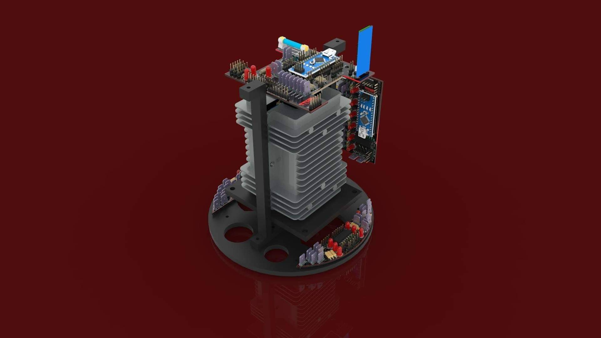
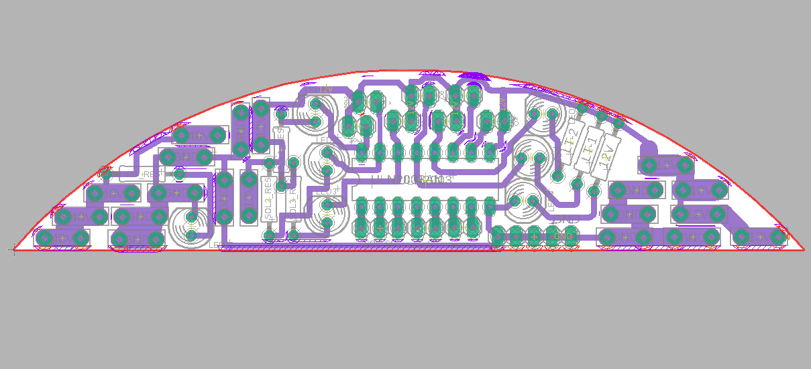
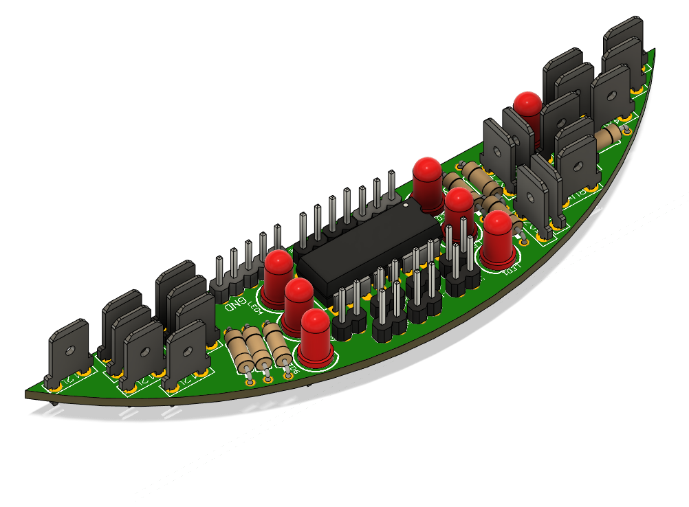
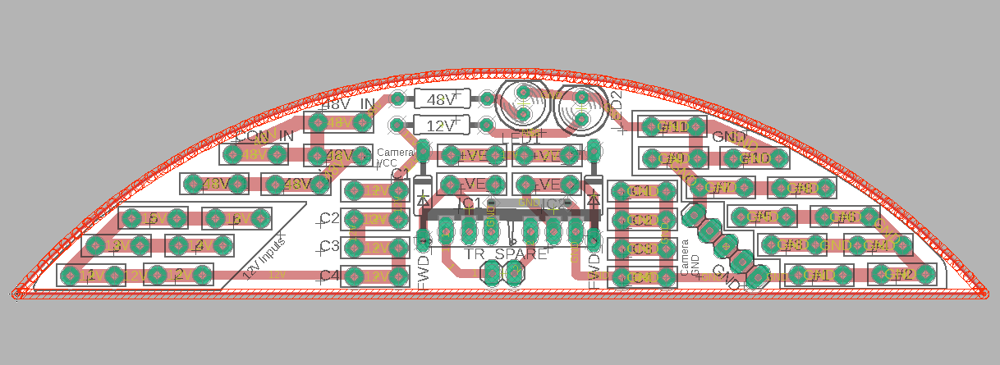
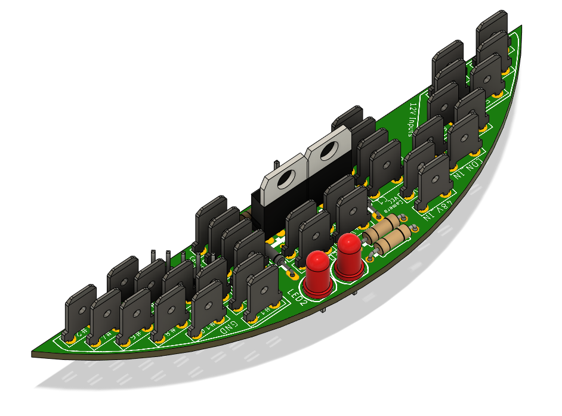
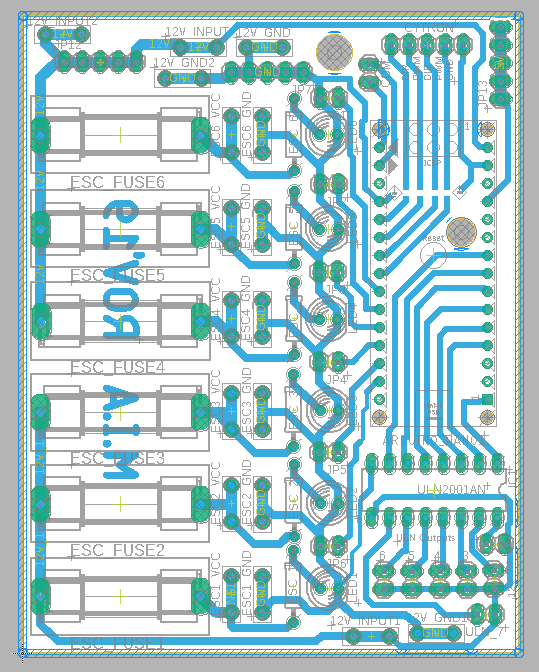
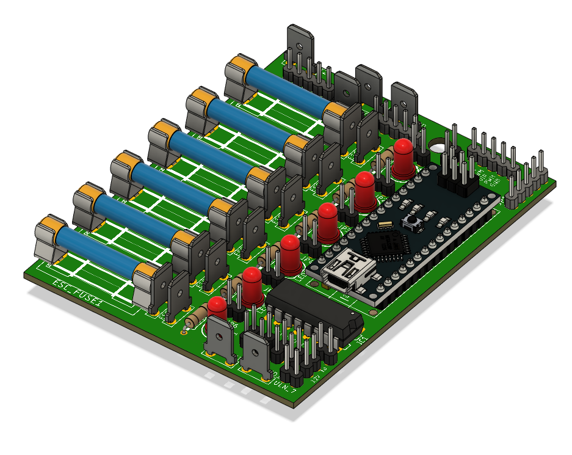
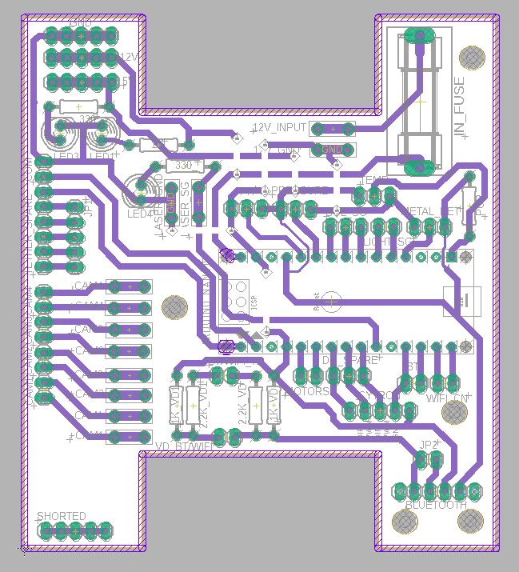
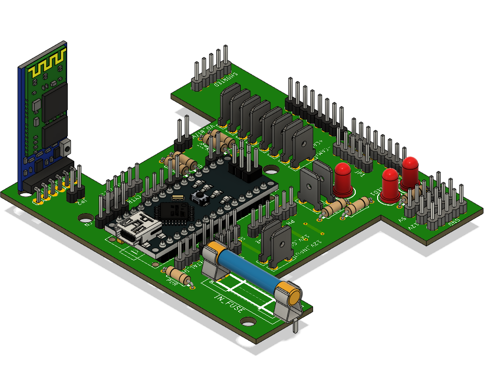

# ORION Remotely Operated Vehicle Hardware Design

These are the printed circuit boards (PCBs) designed for controlling the Remotely Operated Vehicle (ROV) which participated in the MATE international ROV competition 2019 and won the 7th place internationally and the 1st place locally and regionally.

## The electrical system is integrated using 4 main PCBs:
> ###### 1- **2** PCBs for the power management.
> ###### 2- **2** PCBs for the communication system and actuators' control.

***Power management PCBs' specifications:***
> ###### 1- Single layer.
> ###### 2- Voltage input range from 48V to 36V. 
> ###### 3- Over-current, voltage and thermal safety system

***Communication and actuators' control PCBs' specification:***
> ###### 1- Single layer.
> ###### 2- Voltage input range from 12V to 9V.
> ###### 3- The required voltage output with 99% efficiency
> ###### 4- Data transferring capability over Bluetooth/USB serial.

# Electronics' Enclosure Assembly

# Board I
 

# Board II
 

# Board 2
 

# Board 3
 
